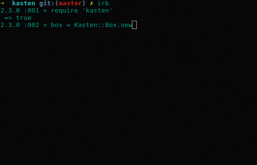

# Kasten  

Let users draw a Kasten (German for box) in an X environment and get it's dimensions

## Usage

run `gem install kasten` or add it to your Gemfile and run bundle install, then:

    require 'kasten'

    dimensions = Kasten.kasten
    p dimensions
    #  => {"x"=>532, "y"=>484, "w"=>265, "h"=>187}

This gives you the raw hash.

There's also a convenience class that makes things slightly more comfortable:

    box = Kasten::Box.new
    # => #<Kasten::Box:0x000000015840c0 @x=265, @y=701, @w=235, @h=162>
    box.x
    # => 265
    box.to_s
    # "x: 265, y: 701, w: 235, h: 162"

Yes, it's that simple.

Here, look at a demo recorded with the screen_recorder example.

## Troubleshooting

If the Gem doesn't compile for you, you might need to install libx11-dev. So on Debian based systems do `sudo apt-get install libx11-dev` first.
